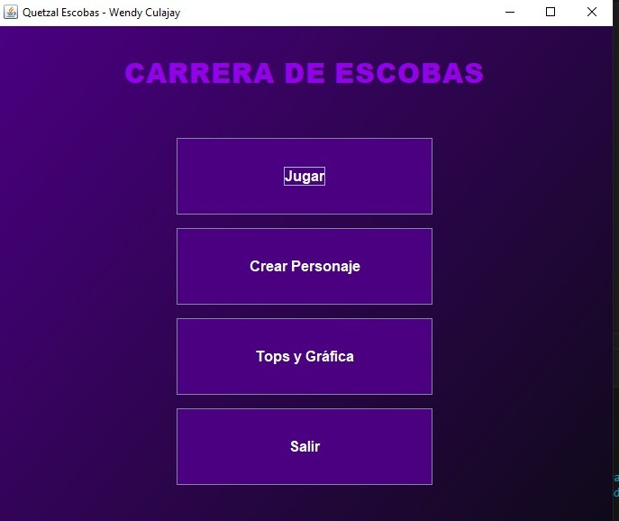
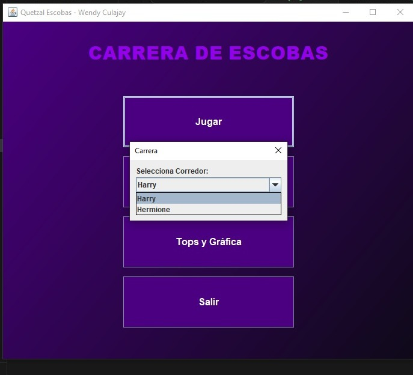
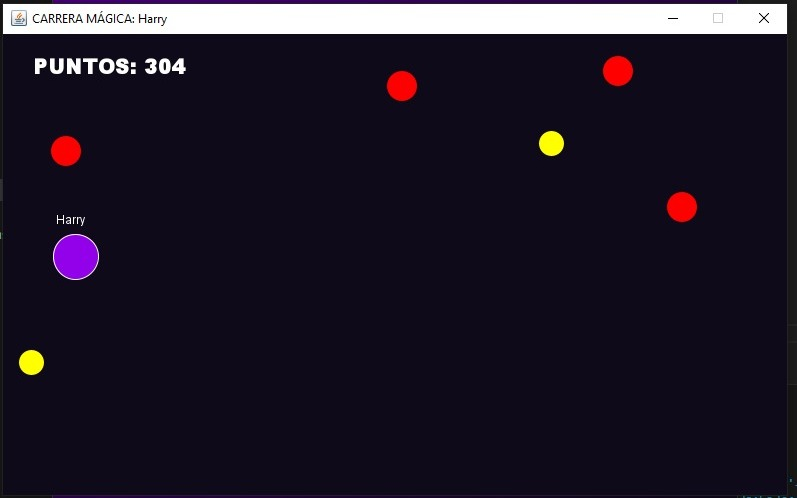
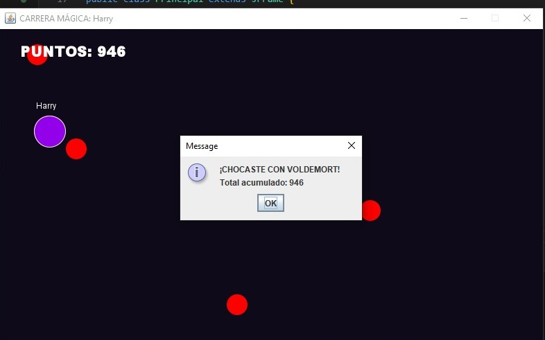
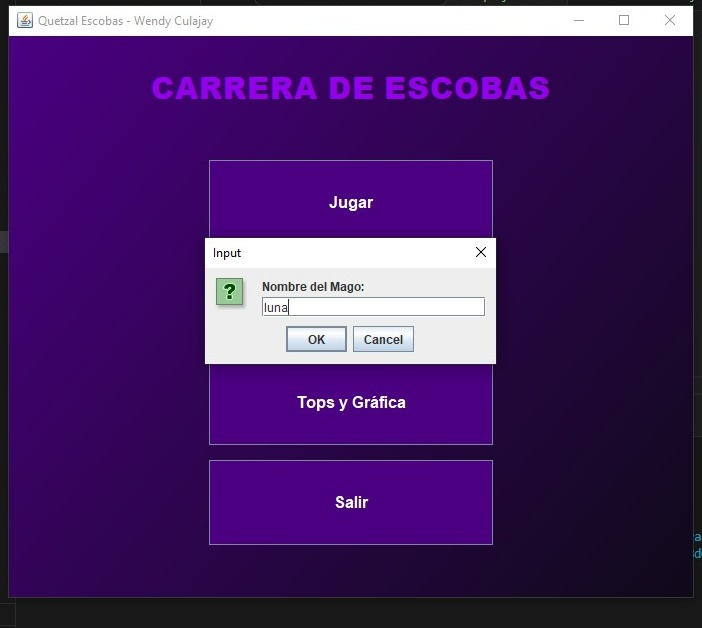
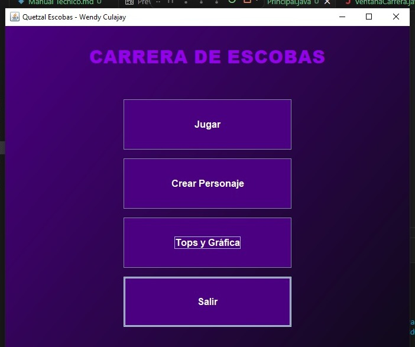

# Manual de Usuario

## Sistema: Quetzal Escobas

**Autor:** Wendy Culajay
**Curso:** IPC1

---

## 1. Introducción

El sistema *Quetzal Escobas* es una aplicación de escritorio que permite al usuario participar en una carrera mágica, crear personajes, visualizar estadísticas y consultar resultados de partidas.

Este manual describe el uso básico del sistema y sus principales funcionalidades.

---

## 2. Requisitos del sistema

* Java JDK 8 o superior
* Sistema operativo Windows, Linux o macOS
* Entorno gráfico compatible con Java Swing

---

## 3. Ejecución del programa

1. Abrir la carpeta del proyecto
2. Compilar el programa:

   ```bash
   javac Principal.java
   ```
3. Ejecutar:

   ```bash
   java Principal
   ```

---

## 4. Pantalla principal

Al iniciar el sistema se muestra el menú principal con las siguientes opciones:

* Jugar
* Crear personaje
* Tops y gráfica
* Salir



---

## 5. Funcionalidades

### 5.1 Jugar

Permite iniciar una carrera seleccionando un personaje.

Pasos:

1. Presionar el botón "Jugar"
2. Seleccionar un personaje disponible
3. Iniciar la carrera



---

### 5.2 Carrera

Durante la carrera el usuario controla el personaje utilizando el teclado:

* Flecha arriba: mover hacia arriba
* Flecha abajo: mover hacia abajo

Objetivo:

* Evitar obstáculos
* Recoger premios
* Acumular puntos



---

### 5.3 Total acumulado

Al finalizar la partida se muestra el puntaje total obtenido.



---

### 5.4 Crear personaje

Permite agregar un nuevo personaje al sistema.

Pasos:

1. Presionar "Crear personaje"
2. Ingresar el nombre
3. Confirmar



---

### 5.5 Tops y gráfica

Muestra estadísticas de las partidas jugadas.

Incluye:

* Gráfica de barras
* Historial de resultados
* Opción para exportar reporte


---

### 5.6 Salir

Permite cerrar la aplicación.

Pasos:

1. Presionar el botón "Salir"
2. El sistema se cerrará automáticamente



---

## 6. Consideraciones

* Es necesario jugar al menos una partida para visualizar estadísticas
* Los datos se almacenan temporalmente en memoria
* El sistema no guarda información al cerrar

---

## 7. Posibles errores

| Problema                 | Solución                           |
| ------------------------ | ---------------------------------- |
| No responde el teclado   | Hacer clic en la ventana del juego |
| No aparecen estadísticas | Jugar al menos una partida         |
| El programa no inicia    | Verificar instalación de Java      |

---

## 8. Conclusión

El sistema permite una interacción sencilla y dinámica, facilitando la simulación de una carrera y el registro de resultados de manera visual.

---
 
